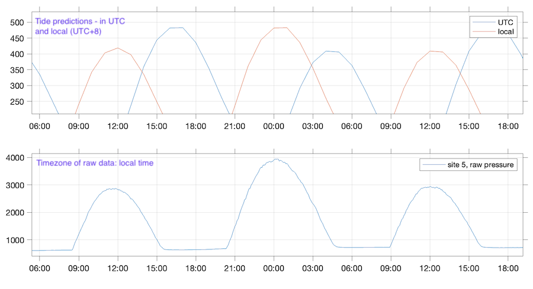
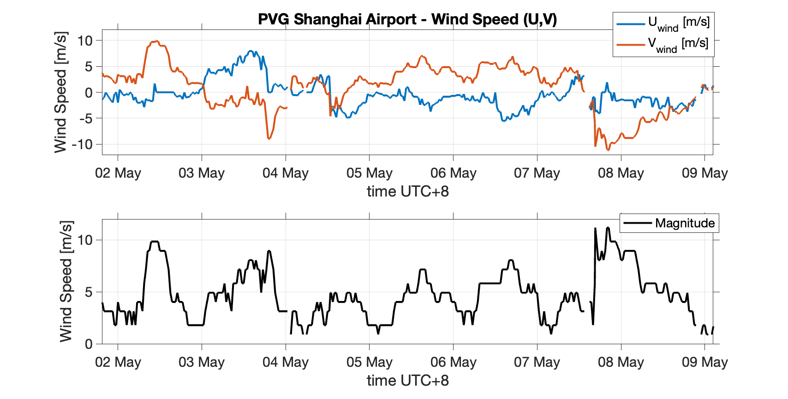
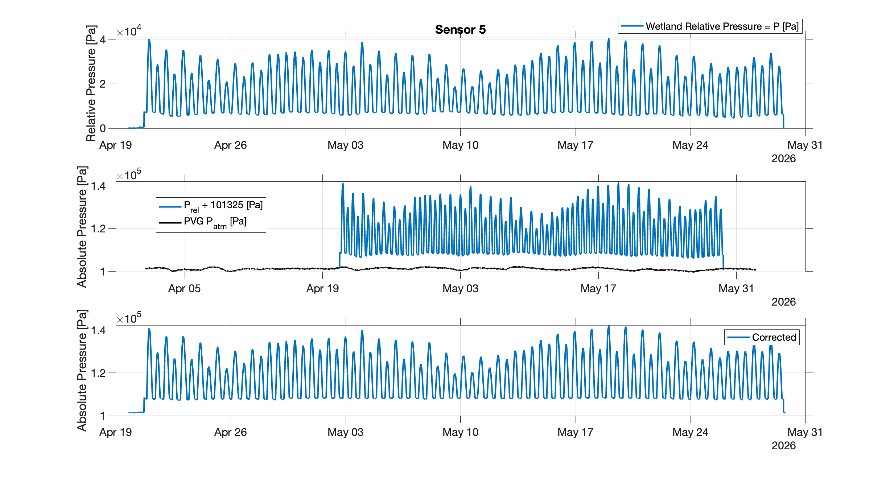
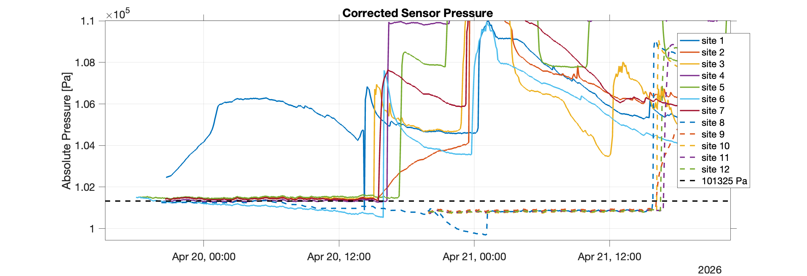
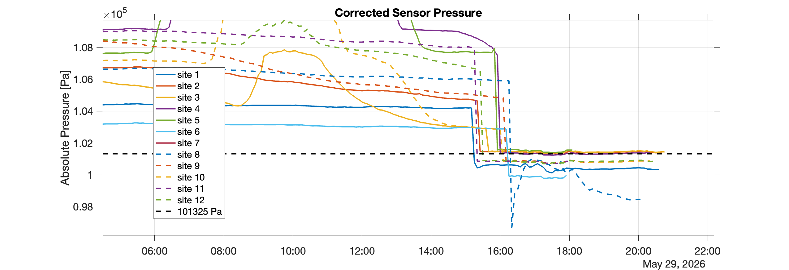

##### 21 July 2026

###### Raw data

Quickly look at data from Nanhui wetland. There are 12 sensors, recording pressure, temperature, and conductivity at the locations:


Script `quick_read_plot_nanhui.m`

Image: 


***

Are the data corrected for atmospheric pressure? Low-water suggests no, this variability looks like atmospheric pressure variability. Will need to correct. Ideally with the data from the met stations in the wetland, but look for public data for now.


***

###### Atmospheric conditions (pressure, wind, air temperature)

We need atmospheric data to correct pressure sensors at Nanhui, look for airport data.

Script to download data: `downloadWunderground.m`

```matlab
T = downloadWunderground('ZSPD:9:CN', ...
datetime(2026,4,1), ...
datetime(2026,6,1), ...
apiKey);


% site: PVG: ZSPD:9:CN
```

###### Tides

Tide data? There are oceanic data via the National Marine Data Center: https://mds.nmdis.org.cn

Tidal predictions close to the wetland at the site: https://mds.nmdis.org.cn/pages/tidalCurrent.html 

Select predictions for: 芦潮港(南汇嘴)

Script to download the tidal predictions: `downloadNMDISTides.m`

```matlab
 T = downloadNMDISTides( ...
     'T067', ...
     datetime(2026,4,1), ...
     datetime(2026,6,1));
```

Script to download, and plot: `download_plot_tide_predictions_nanhui.m`

Tide predictions for April and May:


***

Use the tide data to verify the timezone of the raw data. Shanghai local time is UTC+8. Comparing water level and tide predictions (with known timezone) shows that the raw data are in local time.




##### 22 July 2026

Atmospheric data from Shanghai PVG data: uses `downloadWunderground.m` to download airport (historic) data from https://www.wunderground.com/weather/ZSPD, saves as csv in external data folder. 

Script to plot: `plot_pvg_weather.m`

Data during April - May 2026 are:


Converting wind speed and direction to U and V (looking because there is a water level anomaly on 4 May):




***

Steps for atmospheric correction of pressure sensor data:

1. Match timezone (use UTC).
2. Correct units (conversion: 9.80638 mm h2o@4C= 1 Pa; Atmospheric pressure standard 101325 Pa). 
3. Subtract atmospheric pressure from wetland sensors. 
4. Optional: convert to water level, but this needs some density considerations. E.g. use T and C to calculate rho, and use that value to get water level H. 

Steps 1-3 currently in `quick_read_plot_nanhui.m` (though not saving yet).

For sensor 5, the correction looks like this:



Applying the atmospheric correction to all the sensors, want to check water level offset.. The sensors should all be the same when they are out of the water. They are not (quite): 




Questions: 

-  How does the sensor zero the pressure? I assumed/guessed standard atmosphere, but it might take a reading at the moment of start and zero from there. 


