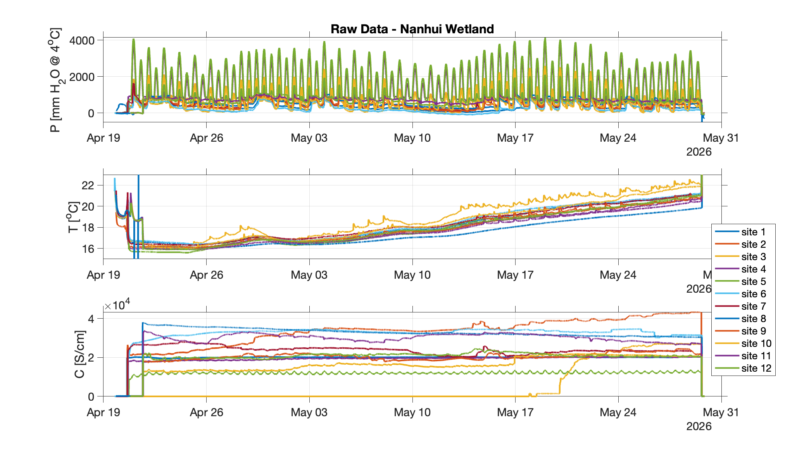
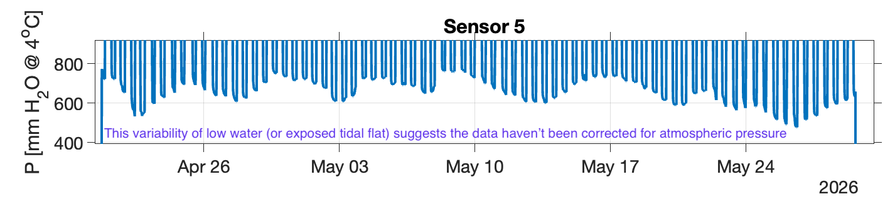
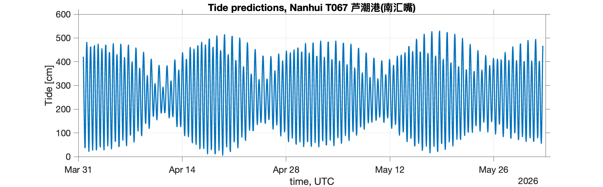
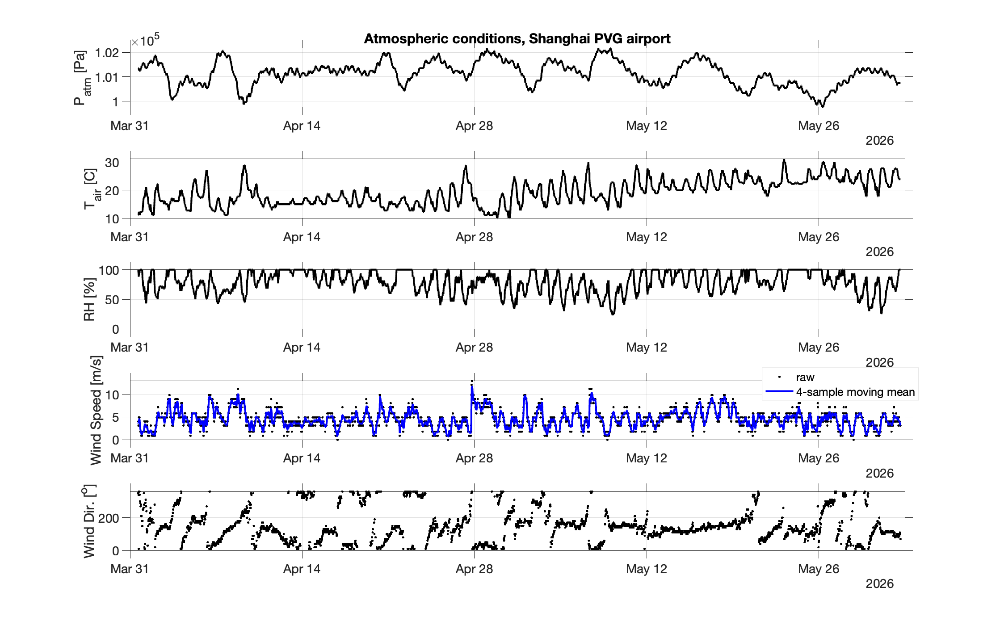

##### 21 July 2026

###### Raw data

Quickly look at data from Nanhui wetland. There are 12 sensors, recording pressure, temperature, and conductivity at the locations:


Script `quick_read_plot_nanhui.m`

Image: 



***

Are the data corrected for atmospheric pressure? Low-water suggests no, this variability looks like atmospheric pressure variability. Will need to correct. Ideally with the data from the met stations in the wetland, but look for public data for now.




***

###### Atmospheric conditions (pressure, wind, air temperature)

We need atmospheric data to correct pressure sensors at Nanhui, look for airport data.

Script to download data: `downloadWunderground.m`

```matlab
T = downloadWunderground('ZSPD:9:CN', ...
datetime(2026,4,1), ...
datetime(2026,6,1), ...
apiKey);


% site: PVG: ZSPD:9:CN
```

###### Tides

Tide data? Tidal predictions close to the wetland at the site: https://mds.nmdis.org.cn/pages/tidalCurrent.html 

Select predictions for: 芦潮港(南汇嘴)

Script to download the tidal predictions: `downloadNMDISTides.m`

```matlab
 T = downloadNMDISTides( ...
     'T067', ...
     datetime(2026,4,1), ...
     datetime(2026,6,1));
```

Script to download, and plot: `download_plot_tide_predictions_nanhui.m`

Tide predictions for April and May:


##### 22 July 2026

Atmospheric data from Shanghai PVG data: uses `downloadWunderground.m` to download airport (historic) data from https://www.wunderground.com/weather/ZSPD, saves as csv in external data folder. 

Data during April - May 2026 are:

