##### 21 July 2026

###### Raw data

Quickly look at data from Nanhui wetland. There are 12 sensors, recording pressure, temperature, and conductivity at the locations:


Script `quick_read_plot_nanhui.m`:

Image: 

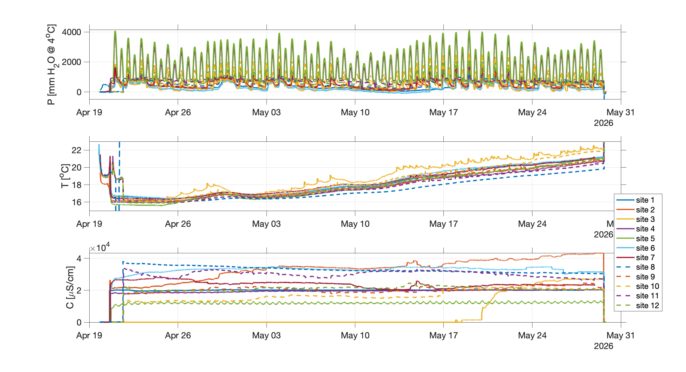

Data show: 12 sensors, pressure, temperature, and conductivity. Pressure: some stations have large tides, others no tide present. Temperature - warming from April to May, though not always positive dT/dt. Conductivity: sensor at site 3 looks like bad data. Sites 3 and 8 have temperature a little outside of the range of the other values - may also be suspect data. 

***

Are the data corrected for atmospheric pressure? Low-water suggests no, this variability looks like atmospheric pressure variability. Will need to correct. Ideally with the data from the met stations in the wetland, but look for public data for now.

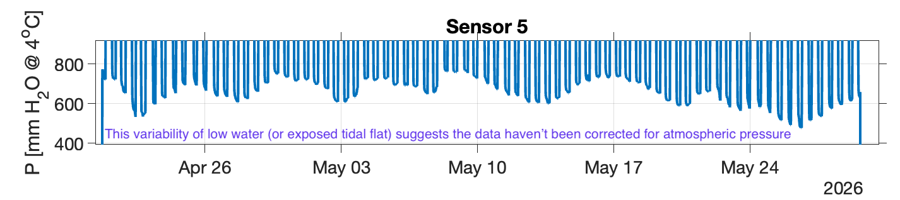


***

###### Atmospheric conditions (pressure, wind, air temperature)

We need atmospheric data to correct pressure sensors at Nanhui, look for airport data.

Script to download data: `downloadWunderground.m`

```matlab
T = downloadWunderground('ZSPD:9:CN', ...
datetime(2026,4,1), ...
datetime(2026,6,1), ...
apiKey);


% site: PVG: ZSPD:9:CN
```

###### Tides

Tide data? There are oceanic data via the National Marine Data Center: https://mds.nmdis.org.cn

Tidal predictions close to the wetland at the site: https://mds.nmdis.org.cn/pages/tidalCurrent.html 

Select predictions for: 芦潮港(南汇嘴)

Script to download the tidal predictions: `downloadNMDISTides.m`

```matlab
 T = downloadNMDISTides( ...
     'T067', ...
     datetime(2026,4,1), ...
     datetime(2026,6,1));
```

Script to download, and plot: `download_plot_tide_predictions_nanhui.m`

Tide predictions for April and May:
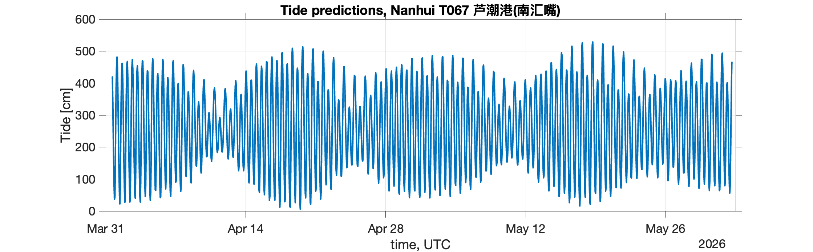

***

Use the tide data to verify the timezone of the raw data. Shanghai local time is UTC+8. Comparing water level and tide predictions (with known timezone) shows that the raw data are in local time.

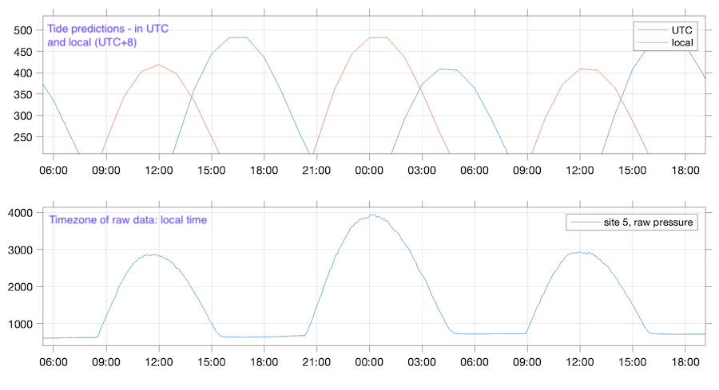

***

##### 22 July 2026

Atmospheric data from Shanghai PVG data: uses `downloadWunderground.m` to download airport (historic) data from https://www.wunderground.com/weather/ZSPD, saves as csv in external data folder. 

Script to plot: `plot_pvg_weather.m`

Data during April - May 2026 are:

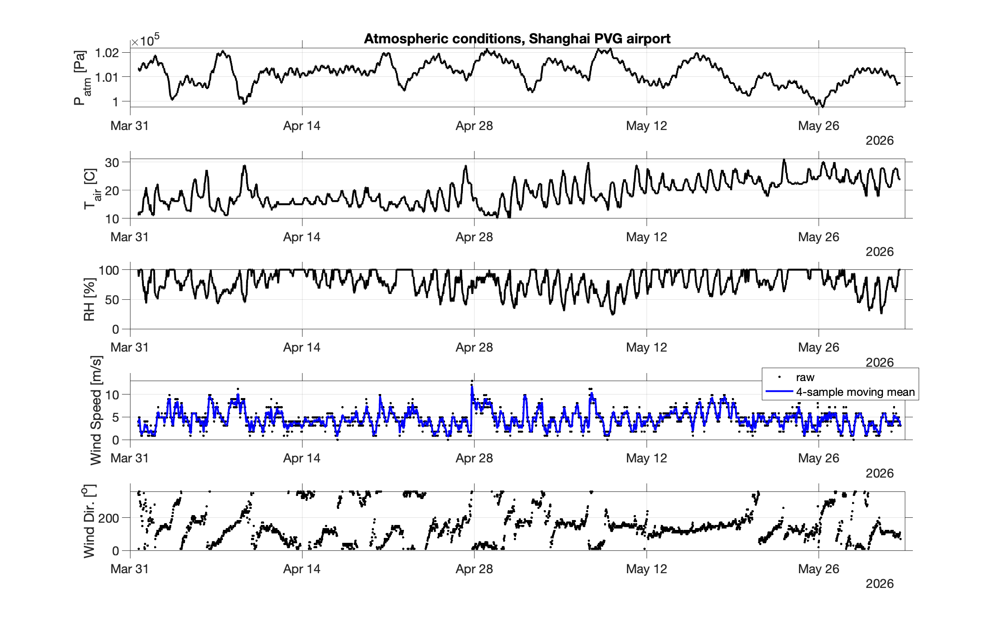


Converting wind speed and direction to U and V (looking because there is a water level anomaly on 4 May):

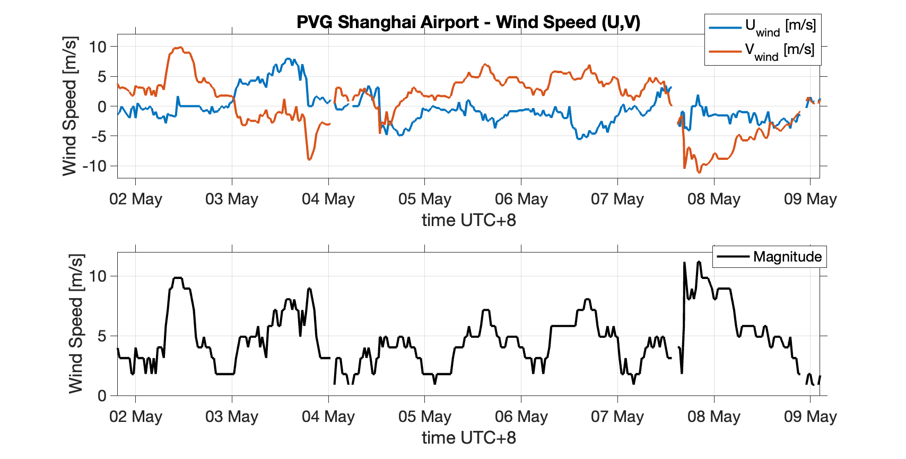


***

Steps for atmospheric correction of pressure sensor data:

1. Match timezone (use UTC).
2. Correct units (conversion: 9.80638 mm h2o@4C= 1 Pa; Atmospheric pressure standard 101325 Pa). 
3. Subtract atmospheric pressure from wetland sensors. 
4. Optional: convert to water level, but this needs some density considerations. E.g. use T and C to calculate rho, and use that value to get water level H. 

Steps 1-3 currently in `quick_read_plot_nanhui.m` (though not saving yet).

For sensor 5, the correction looks like this:

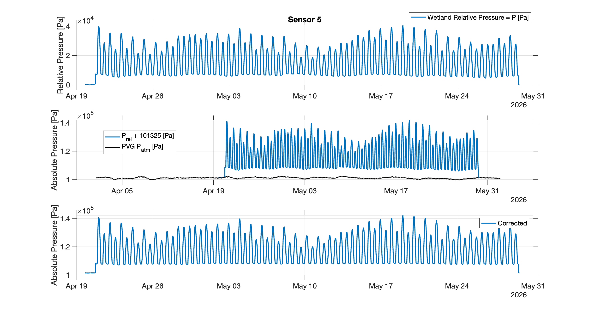

Applying the atmospheric correction to all the sensors, want to check water level offset.. The sensors should all be the same when they are out of the water. They are not (quite): 

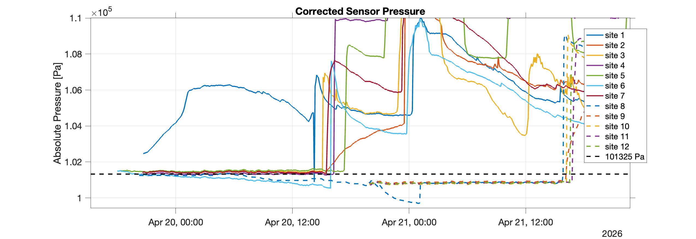
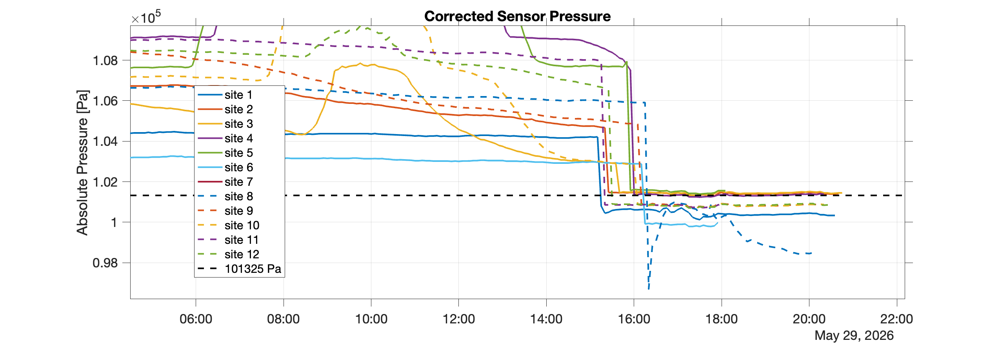

Questions: 

-  How does the sensor zero the pressure? I assumed/guessed standard atmosphere, but it might take a reading at the moment of start and zero from there. 


***

##### 23 July 2026

###### Convert conductivity and temperature to salinity and density

Use Gibbs Seawater Toolbox (https://teos-10.org/pubs/gsw/html/gsw_contents.html) to convert to absolute salinity (g/kg) and rho (kg/m3).

Script: `scripts/convert_sensor_T_C_to_rho_S.m`

Data from 11 sensors. Conductivity on the sensor at site 3 is bad, the temperature at that site also looks weird, have omitted it here:

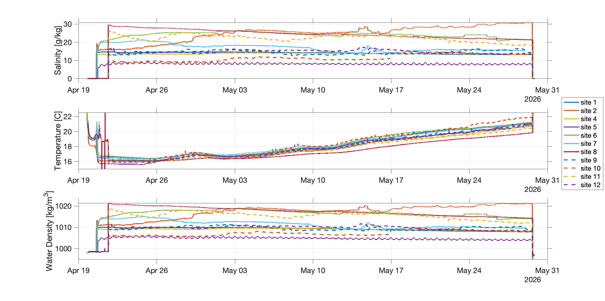

We can look at the S-T diagram to see if there are identifiable water masses. Not sure it tells us much. 

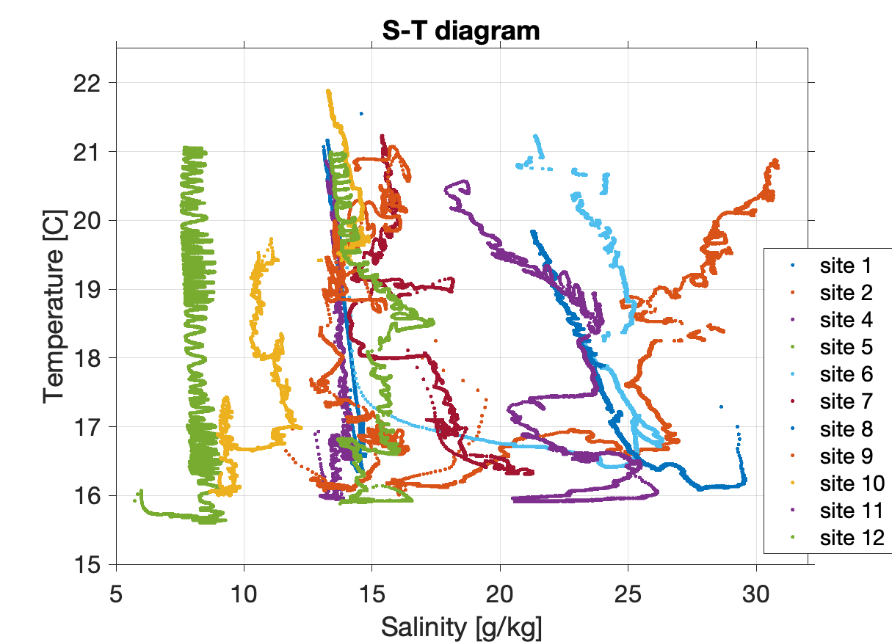

Some observations on the salinity data. Salinity is obviously tidally variable at three sites:

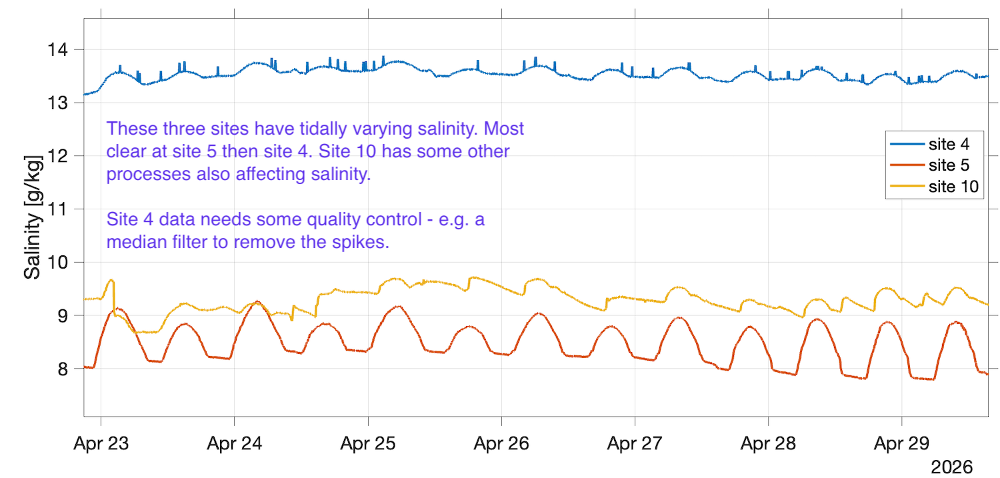

And, at four (or five) sites, there was a clear salinity peak near 14 May.

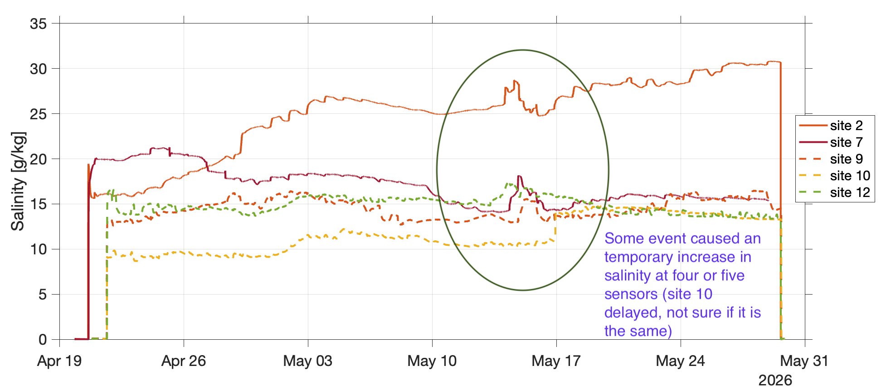. 

Looking at the other variables for that range - there is a transition in temperature from smooth (non-tidal) to perhaps tidal that occurs with this event.

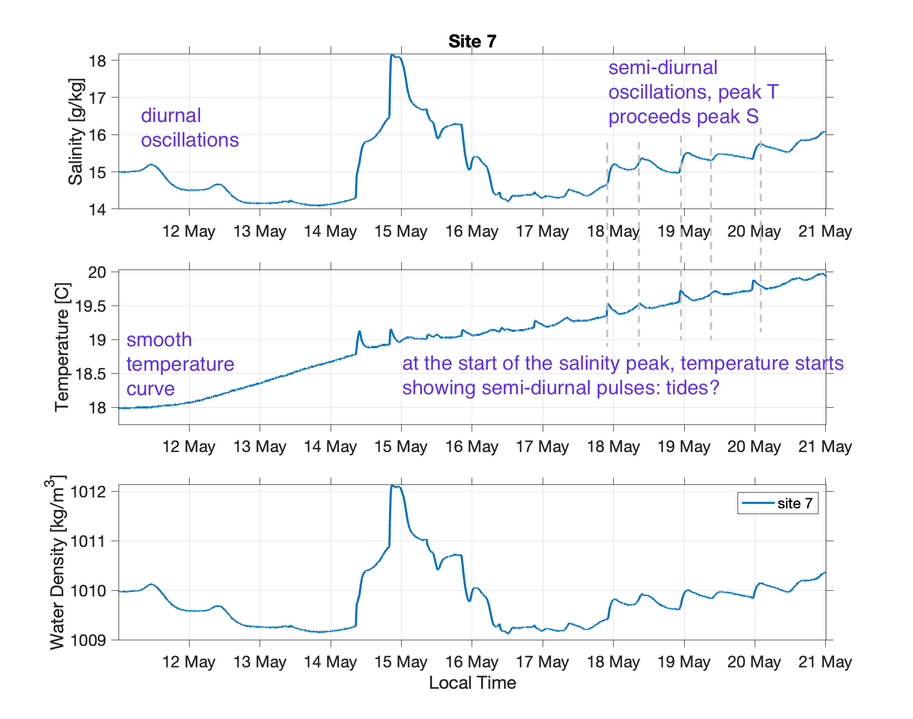.


***

Stations 1:5 (transect across flat)
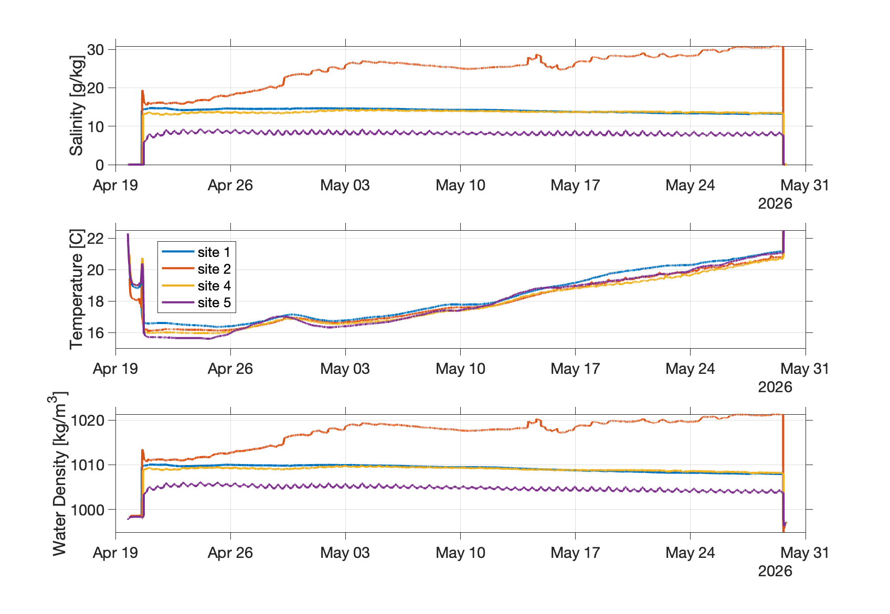

***

##### 24 July 2026

Questions: 
- What does the literature say about short term processes and their influence on intertidal flat hydrology, salt transport, and heat flux? 
- What is the ocean boundary condition at Nanhui wetland - tides, salinity, general dynamics of the East China Sea and the Changjiang plume? 

A quick literature search, some possibly useful references:

###### Tides, storm surge

Heiss, J. W., Post, V. E. A., Laattoe, T., Russoniello, C. J., & Michael, H. A. (2017). Physical controls on biogeochemical processes in intertidal zones of beach aquifers. Water Resources Research, 53, 9225–9244. https://doi.org/10.1002/2017WR021110 

Huizer, S., M. C. Karaoulis, G. H. P. Oude Essink, and M. F. P. Bierkens (2017), Monitoring and simulation of salinity changes in response to tide and storm surges in a sandy coastal aquifer system, Water Resour. Res., 53, 6487–6509, doi:10.1002/2016WR020339. 

Kim, K. H., Heiss, J. W., Michael, H. A., Cai, W.-J., Laattoe, T., Post, V. E. A., & Ullman, W. J. (2017). Spatial patterns of groundwater biogeochemical reactivity in an intertidal beach aquifer. Journal of Geophysical Research: Biogeosciences, 122, 2548–2562. https://doi.org/10.1002/2017JG003943 

Fu, T., Zhang, Y., Guo, X., Xing, C., Xiao, X., Lei, B., ... & Li, M. (2024). Salt transport dynamics across the sediment-underground brine interface driven by tidal hydrology and benthic crab burrowing in muddy tidal flats. Estuarine, Coastal and Shelf Science, 296, 108586.

Holt, T., Seibert, S. L., Greskowiak, J., Freund, H., & Massmann, G. (2017). Impact of storm tides and inundation frequency on water table salinity and vegetation on a juvenile barrier island. Journal of Hydrology, 554, 666-679.

Turner, I. L. (1998). Monitoring groundwater dynamics in the littoral zone at seasonal, storm, tide and swash frequencies. Coastal Engineering, 35(1-2), 1-16.

Cantelon, J. A., Robinson, C. E., & Kurylyk, B. L. (2023). Morphologic, atmospheric, and oceanic drivers cause multi‐temporal saltwater intrusion on a remote, sand island. Water Resources Research, 59(10), e2023WR035820.

Wilson, A. M., & Morris, J. T. (2012). The influence of tidal forcing on groundwater flow and nutrient exchange in a salt marsh-dominated estuary. Biogeochemistry, 108(1), 27-38.

###### Heat flux, heat balance

Rinehimer, J. P., & Thomson, J. T. (2014). Observations and modeling of heat fluxes on tidal flats. Journal of Geophysical Research: Oceans, 119(1), 133-146.

Liu, Q., Polerecky, L., Rios‐Yunes, D., & Soetaert, K. (2025). Simulating the thermal response of tidal sediments by integrating numerical modeling and field measurements. Journal of Geophysical Research: Oceans, 130(10), e2025JC023263.

Rinehimer, J. P., Thomson, J., & Chickadel, C. C. (2013). Thermal observations of drainage from a mud flat. Continental Shelf Research, 60, S125-S135.

Kong, G., Li, L., & Guan, W. (2022). Influences of tidal flat and thermal discharge on heat dynamics in xiangshan bay. Frontiers in Marine Science, 9, 850672.

Kim, T. W., & Cho, Y. K. (2009). Heat flux across the surface of a macrotidal flat in southwest Korea. Journal of Geophysical Research: Oceans, 114(C7).

###### East China Sea oceanography 

Mo, D., Li, J., Hou, Y., & Hu, P. (2023). Modeling the sea level response of the northern East China Sea to different types of extratropical cyclones. Journal of Geophysical Research: Oceans, 128, e2022JC018728. https://doi.org/10.1029/2022JC018728 

Lozovatsky, I., Liu, Z., Wei, H., & Fernando, H. J. S. (2008). Tides and mixing in the northwestern East China Sea Part I: Rotating and reversing tidal flows. Continental Shelf Research, 28(2), 318-337.

Guo, X., & Yanagi, T. (1998). Three-dimensional structure of tidal current in the East China Sea and the Yellow Sea. Journal of Oceanography, 54(6), 651-668.


##### Yangtze / Changjiang River Plume

Lee, S. W., Lee, D., Noh, S., Kim, G. U., Park, S. H., Jeong, J. Y., ... & Choi, J. Y. (2025). Sequential evolution of Changjiang Diluted Water and its impact on stratification and phytoplankton blooms in the East China Sea during summer 2020. Journal of Geophysical Research: Oceans, 130(8), e2025JC022655.

Cheng, P. (2024). Dispersal of the Changjiang River water in East Asian shelf seas. Journal of Geophysical Research: Oceans, 129(12), e2024JC021351.

Liu, Z., Gan, J., Wu, H., Hu, J., Cai, Z., & Deng, Y. (2021). Advances on coastal and estuarine circulations around the Changjiang Estuary in the recent decades (2000–2020). Frontiers in Marine Science, 8, 615929.

Li, X., Gong, X., & Yuan, D. (2026). Seasonal and interannual variations of the Changjiang Diluted Water in the East China Sea observed by the SMAP satellite. Journal of Geophysical Research: Oceans, 131(3), e2024JC022215.

Huang, R., Jiang, L., Cheng, X., & Burchard, H. (2025). Bifurcated upshelf extension of the Yangtze River plume. Journal of Geophysical Research: Oceans, 130(10), e2025JC022937.

Zhang, Z., Wu, H., Yin, X., & Qiao, F. (2018). Dynamical response of Changjiang River plume to a severe typhoon with the surface wave‐induced mixing. Journal of Geophysical Research: Oceans, 123(12), 9369-9388.

Guan, S., Huang, M., Lin, II. et al. Widespread sea surface salinification induced by tropical cyclones over the Changjiang River Plume. Commun Earth Environ 6, 337 (2025). https://doi.org/10.1038/s43247-025-02317-xs


This one indicates that there is always CDW at the Nanhui wetland: 
Wu, T., & Wu, H. (2018). Tidal mixing sustains a bottom-trapped river plume and buoyant coastal current on an energetic continental shelf. Journal of Geophysical Research: Oceans, 123, 8026–8051. https://doi.org/10.1029/2018JC014105 

Son YB and Choi J-K (2022) Mapping the Changjiang Diluted Water in the East China Sea during summer over a 10-year period using GOCI satellite sensor data. Front. Mar. Sci. 9:1024306. doi: 10.3389/fmars.2022.1024306

###### Nanhui Wetland literature


This one has ADV measurements (across one tidal period?), in Chinese: 
Minghui, C. U. I., et al. "Wave characteristics and their influencing factors on Nanhui tidal flats in the Changjiang Estuary." Journal of Marine Sciences 41.2 (2023): 28-44.

Wang, Jie, et al. "Coastal engineering structures bifurcate intertidal eco‐morphodynamic trajectories in a sediment‐starved delta." Sedimentology 73.2 (2026): 560-587.

Dong, Haoyu, et al. "Evaluation of the carbon accumulation capability and carbon storage of different types of wetlands in the Nanhui tidal flat of the Yangtze River estuary." Environmental Monitoring and Assessment 192.9 (2020): 585.

Du, Xinglin, et al. "Effects of variations in hydrological connectivity on the macrobenthic community structure in reclaimed wetlands." Science of the Total Environment 954 (2024): 176111.

Liu, Jinlin, et al. "Exploration and implication of green macroalgal proliferation in the Nanhui-east-tidal-flat: an investigation of post-reclamation mudflat wetlands." Frontiers in Marine Science 12 (2025): 1505586

Wu, Mingxuan, et al. "Does soil pore water salinity or elevation influence vegetation spatial patterns along coasts? A case study of restored coastal wetlands in Nanhui, Shanghai." Wetlands 40.6 (2020): 2691-2700.

Li, Chengwei, et al. "Soil characteristics and their potential thresholds associated with Scirpus mariqueter distribution on a reclaimed wetland coast." Journal of Coastal Conservation 6 (2018): 1107-1116.

Gao, Xiaofeng, et al. "The above and the belowground nitrogen allocation strategy of Scirpus mariqueter based on 15N isotope tracing along an elevation gradient and its significance for coastal wetlands restoration." Journal of Plant Nutrition and Soil Science 187.4 (2024): 504-515.

Zhang, Xiaodong, et al. "Spatial-temporal evolution of the eastern Nanhui mudflat in the Changjiang (Yangtze River) Estuary under intensified human activities." Geomorphology 309 (2018): 38-50.

Wei, Taoyuan, et al. "Non-flood season neap tides in the Yangtze estuary offshore: Flow mixing processes and its potential impacts on adjacent wetlands." Physics and Chemistry of the Earth, Parts A/B/C 103 (2018): 127-139.


***

##### 27 July 2026

###### What are the next steps with this data?

First, *data quality control*, setting everything into a uniform (vertical) datum. 

- Pressure sensors should be corrected for atmospheric pressure using the wetland meteorological station (relative pressure = absolute pressure - atmospheric pressure). It would be good to compare the wetland meteorological station with the data at PVG or other publicly available data. Does the Key Lab for Marine Geology have a met station? Best is to have your own (high frequency) data, but in case of likely data gaps (e.g. charging the met station), a validation/comparison of the local data to some other data is also fine (so long as they agree). Also need to take into account how the pressure sensor is 'zeroing' the pressure. Most likely when the sensor is programmed, there is either automatic or manual setting of atmospheric pressure. In the script above I subtracted standard atmosphere (101325 Pa) and it matches up pretty well, but maybe not perfectly. Generally when the sensor is installed, you'll see an offset of a few hundred pascals, I usually verify that the offset is similar on deployment and recovery and remove it. Though, since these are subsurface sensors relative pressure could be a little negative... 

- Map vertical positions of sensors. If you didn't have elevations, I would start by assuming that at high tide the water surface is flat, and adjust sensor vertical position z accordingly. Since you have topography and (I hope) sensor position below the surface, start with these data and compare to the assumption above. 

- Decide if it is easier to work in pressure (Pa, dbar, etc.) or in column of water (m). If column of water: you'll need to convert from p to h, best practice would be to convert temperature and conductivity to water density and use the local value for the column of water. Realistically, the difference using the measurements instead of setting a fixed water density (e.g. rho = 1005 kg/m3) will be small.

- To convert C and T to salinity and density, use Gibbs Seawater Toolbox (available in matlab, C, Fortran, Julia, etc: https://teos-10.org/software.htm)

- Quality control on C and T: You should do a bucket test when the sensors are recovered: put all the sensors (recording) into a water tank with well mixed (uniform T) water. Mix in salt to have several data points. Ideally all of the sensors should give the same values of P, C and T. If not, troubleshoot from there. An in-field test option is to put all the sensors together and see how they compare - but this is easier in an estuary than on a tidal flat with 4m tides. 

- Sensor time zone: pick either local time or UTC to maintain all your data. I prefer UTC because there is no daylight savings (I don't know if China changes clocks in summer) and most science-quality public data is in UTC. That said, since Shanghai is UTC+8, local time is more useful if you're trying to interpret a plot of diurnal water temperature. The tide predictions I found are given in local time. Make sure to always label dataset time with the time zone.


Next, *comparison data*. What are the forcings or boundary conditions for this wetland? At a minimum, the following:

- tidal water level (actual data, not predictions)
- ocean wave climate
- wind speed and direction

It would be nice to have ocean temperature and (surface?) salinity near your site.

Review the literature for East China Sea processes. Does the Yangtze plume affect the water level? Does the Yangtze streamflow need to be taken into consideration?

Data sources: First, look for buoys and port data. Ocean wave climate (and wind) - you can look at climate reanalysis products - e.g. ERA5. NOAA has a global Wave Watch III product as well. 


Then, use your measurements and the comparison data to begin to ask questions of the observational dataset:


First questions to ask of this dataset:

- What physical processes control water balance / water flux in this wetland? At site 5 the tide dominance is clear, the tide measured varies. See images below: low tide, high tide. 

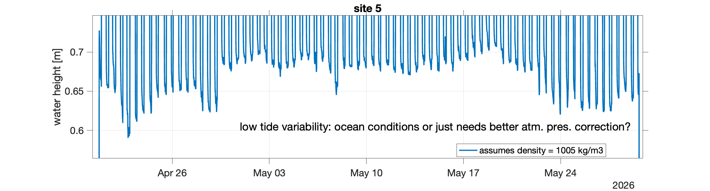

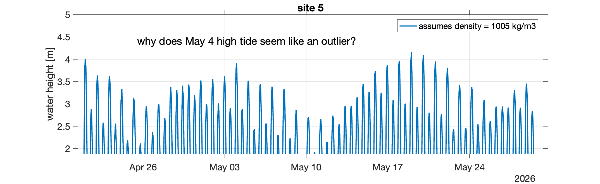


Farther up the flat, still see tides, but need to quantify when and how the flooding / draining is changed.

Site 11:

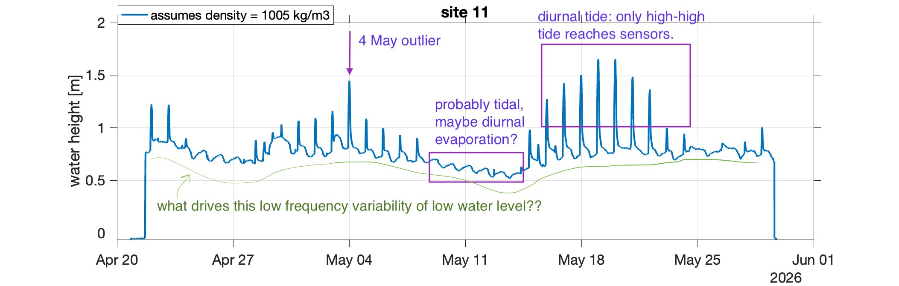

Site 6: 

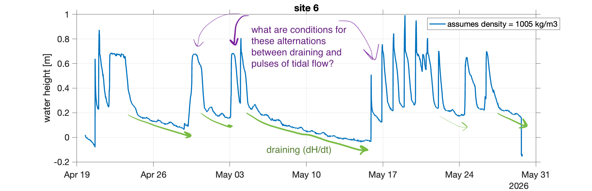


- Given your study, beyond that probably the next question is about salt movement. Similar question could just be 'what physical processes control the salt balance/flux?'

- And, since you have nice temperature data - what controls the heat flux? 
